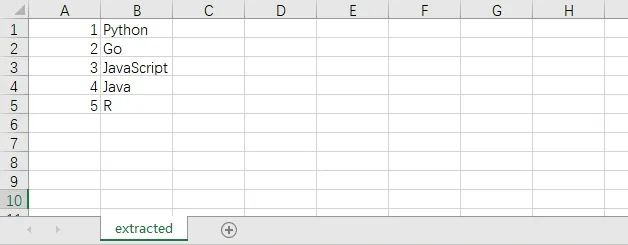

# 10个有趣的Python高级脚本

## ▍1、Jpg转Png

- 图片格式转换，以前可能第一时间改文件名(｀・ω・´)。
- 如今编写一个Python脚本就能完成各种图片格式的转换，此处以jpg转成png为例。
- 有两种解决方法，都分享给大家。

```python
# 图片格式转换, Jpg转Png

# 方法①
from PIL import Image

img = Image.open('test.xlsx.jpg')
img.save('test1.png')

# 方法②
from cv2 import imread, imwrite

image = imread("test.xlsx.jpg", 1)
imwrite("test2.png", image)
```

## ▍2、PDF加密和解密

- 如果你有100个或更多的PDF文件需要加密，手动进行加密肯定是不可行的，极其浪费时间。
- 使用Python的pikepdf模块，即可对文件进行加密，写一个循环就能进行批量加密文档。

```python
# PDF加密
import pikepdf

pdf = pikepdf.open("test.xlsx.pdf")
pdf.save('encrypt.pdf', encryption=pikepdf.Encryption(owner="your_password", user="your_password", R=4))
pdf.close()
```

- 有加密那么便会有解密，代码如下：

```python
# PDF解密
import pikepdf

pdf = pikepdf.open("encrypt.pdf", password='your_password')
pdf.save("decrypt.pdf")
pdf.close()
```

## ▍3、获取电脑的配置信息

- 很多小伙伴可能会使用鲁大师来看自己的电脑配置，这样还需要下载一个软件。
- 使用Python的WMI模块，便可以轻松查看你的电脑信息。

```python
# 获取计算机信息
import wmi


def System_spec():
    Pc = wmi.WMI()
    os_info = Pc.Win32_OperatingSystem()[0]
    processor = Pc.Win32_Processor()[0]
    Gpu = Pc.Win32_VideoController()[0]
    os_name = os_info.Name.encode('utf-8').split(b'|')[0].decode('utf-8')
    ram = float(os_info.TotalVisibleMemorySize) / 1048576
    print(f'操作系统: {os_name}')
    print(f'CPU: {processor.Name}')
    print(f'内存: {ram} GB')
    print(f'显卡: {Gpu.Name}')
    print("\n计算机信息如上 ↑ ↑ ↑ ↑ ↑ ↑ ↑ ↑ ↑ ↑ ↑ ↑")


if __name__ == '__main__':
    System_spec()
```

- 就以我自己的电脑为例，运行代码就能看到配置

```text
操作系统: Microsoft Windows 10 专业版
CPU: Intel(R) Core(TM) i3-10100 CPU @ 3.60GHz
内存: 15.833415985107422 GB
显卡: Intel(R) UHD Graphics 630

计算机信息如上 ↑ ↑ ↑ ↑ ↑ ↑ ↑ ↑ ↑ ↑ ↑ ↑
```

## ▍4、解压文件

- 使用zipfile模块进行文件解压，同理也可以对文件进行压缩。

```python
# 解压文件
from zipfile import ZipFile

unzip = ZipFile("file.zip", "r")
unzip.extractall("output Folder")
```

## ▍5、Excel工作表合并

- 帮助你将Excel工作表合并到一张表上，表内容如下图：
  

- 6张表，其余表的内容和第一张表都一样。
- 设置表格数量为5，将会合并前5张表的内容。

```python
import pandas as pd

# 文件名
filename = "test.xlsx"
# 表格数量
T_sheets = 5

df = []
for i in range(1, T_sheets + 1):
    sheet_data = pd.read_excel(filename, sheet_name=i, header=None)
    df.append(sheet_data)

# 合并表格
output = "merged.xlsx"
df = pd.concat(df)
df.to_excel(output)
```

- 结果如下：
  

## ▍6、将图像转换为素描图

- 和之前的图片格式转换有点类似，就是对图像进行处理。
- 以前大家可能会使用到美图秀秀，现在可能就是抖音的滤镜了。
- 其实使用Python的OpenCV，就能够快速实现很多你想要的效果。

```python
# 图像转换
import cv2

# 读取图片
img = cv2.imread("img.jpg")
# 灰度
grey = cv2.cvtColor(img, cv2.COLOR_BGR2GRAY)
invert = cv2.bitwise_not(grey)
# 高斯滤波
blur_img = cv2.GaussianBlur(invert, (7, 7), 0)
inverse_blur = cv2.bitwise_not(blur_img)
sketch_img = cv2.divide(grey, inverse_blur, scale=256.0)
# 保存
cv2.imwrite('sketch.jpg', sketch_img)
cv2.waitKey(0)
cv2.destroyAllWindows()
```

- 原图如下：
  

- 素描图如下，还挺好看的
  

## ▍7、获取CPU温度

- 有了这个Python脚本，你将不需要任何软件来了解CPU的温度。

```python
# 获取CPU温度
from time import sleep
from pyspectator.processor import Cpu

cpu = Cpu(monitoring_latency=1)
with cpu:
    while True:
        print(f'Temp: {cpu.temperature} °C')
        sleep(2)
```

## ▍8、提取PDF表格

- 有的时候，我们需要从PDF中提取表格数据。
- 下面这个简单的脚本将帮助你在一秒钟内完成相同的操作。

```python
# 方法①
import camelot

tables = camelot.read_pdf("tables.pdf")
print(tables)
tables.export("extracted.csv", f="csv", compress=True)

# 方法②, 需要安装Java8
import tabula

tabula.read_pdf("tables.pdf", pages="all")
tabula.convert_into("table.pdf", "output.csv", output_format="csv", pages="all")
```

- PDF文档的内容如下，包含了一个表格。
  

- 提取到的CSV文件内容如下：
  

## ▍9、截图

- 该脚本将简单地截取屏幕截图，而无需使用任何屏幕截图软件。

```python
# 方法①
from mss import mss

with mss() as screenshot:
    screenshot.shot(output='scr.png')

# 方法②
import PIL.ImageGrab

scr = PIL.ImageGrab.grab()
scr.save("scr.png")
```

## ▍10、拼写检查器

- 这个Python脚本可以进行拼写检查，当然只对英文有效，毕竟中文博大精深呐。

```python
# 拼写检查
# 方法①
import textblob

text = "mussage"
print("original text: " + str(text))

checked = textblob.TextBlob(text)
print("corrected text: " + str(checked.correct()))

# 方法②
import autocorrect

spell = autocorrect.Speller(lang='en')

# 以英语为例
print(spell('cmputr'))
print(spell('watr'))
print(spell('survice'))
```