# 百度安全验证（旋转验证逆向）

- 百度安全验证（旋转图片验证）是百度搜索引擎的一种反爬虫机制，当你在百度搜索引擎中搜索一些关键词时，如果你的IP地址在一段时间内搜索次数过多，百度会弹出一个验证窗口，要求你进行验证，验证通过后才能继续搜索。
- 本文将介绍百度安全验证的原理，以及如何使用Python进行逆向，通过逆向js实现验证。
- [百度旋转验证地址](https://wappass.baidu.com/static/captcha/tuxing.html?&logid=11127834097395060321&ak=c27bbc89afca0463650ac9bde68ebe06&backurl=https%3A%2F%2Fwww.baidu.com%2Fs%3Fie%3Dutf-8%26f%3D8%26rsv_bp%3D1%26rsv_idx%3D1%26tn%3Dbaidu%26wd%3DTCL%25E7%25A9%25BA%25E8%25B0%2583%26fenlei%3D256%26oq%3DT%252526lt%25253BL%2525E7%2525A9%2525BA%2525E8%2525B0%252583%2525E5%2525AE%252589%2525E8%2525A3%252585%26rsv_pq%3Dcbfaf83c00055420%26rsv_t%3D4ebe1EPjGBTNFE0M5z%252F%252B8tKVCaYp%252B%252Fd1V%252FQW49ZbgCdWHXDFZ79JUL4TsJs%26rqlang%3Dcn%26rsv_enter%3D0%26rsv_dl%3Dtb%26rsv_btype%3Dt%26inputT%3D1051%26gpc%3Dstf%253D1654569764%252C1670294564%257Cstftype%253D2%26tfflag%3D1&signature=29e3f4de1557982e420aa3db02618e5f&timestamp=1670294566)

---

  请求访问失败返回的重定向链接，获取到参数**ak、backurl**
  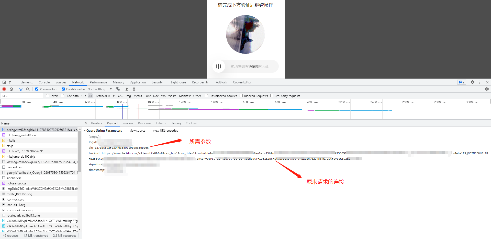
  
  使用刚获取到的参数ak请求 [https://wappass.baidu.com/viewlog](https://wappass.baidu.com/viewlog)，获取去到参数 **as、ds、tk**（ps：参数 callback=jQuery110208753047592364704_1670398954090 jQueryxxx_13位时间戳，是请求跳转链接时js文件mkdjump_db105ab.js中用版本号1.10.2加上随机数再各种弄来弄去生成的[expando: "jQuery" + (nt + Math.random()).replace(/\D/g, "")]，发现固定也可以所以就不管了
  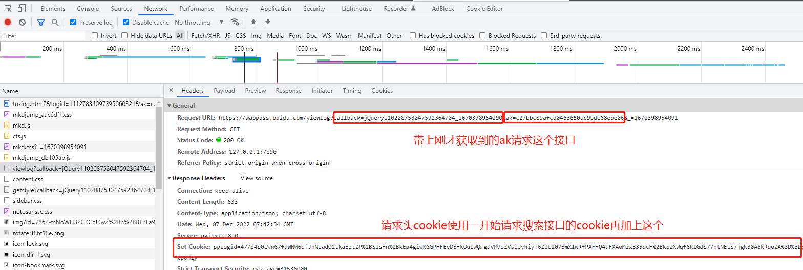
  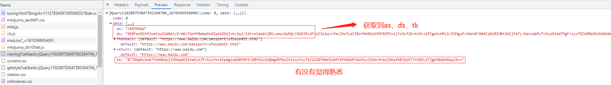
  
  带上前面获取到的参数请求 [https://wappass.baidu.com/viewlog/getstyle](https://wappass.baidu.com/viewlog/getstyle)，获取到参数**backstr和旋转图片的链接**，把图片下载下来，就是需要我们旋转验证的图片
  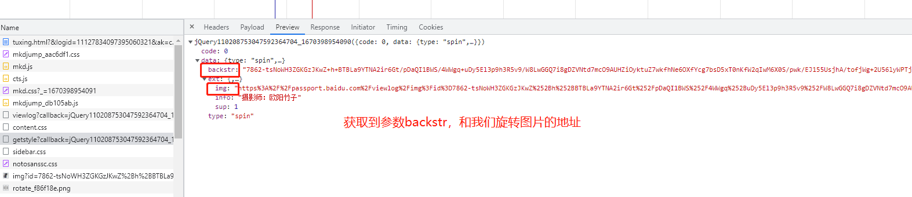
  
  提交旋转验证的参数，请求 [https://wappass.baidu.com/viewlog](https://wappass.baidu.com/viewlog?callback=jQuery110205686999225389437_1670402485002&ak=xxx&as=xxx&fs=xxx&scene=&cv=submit&_=1670402485005) 是不是有点熟悉，就是刚才获取as、ds等参数的链接，不过携带的请求参数不一样，浏览器调试跟进去看看，重点在r.rzData
  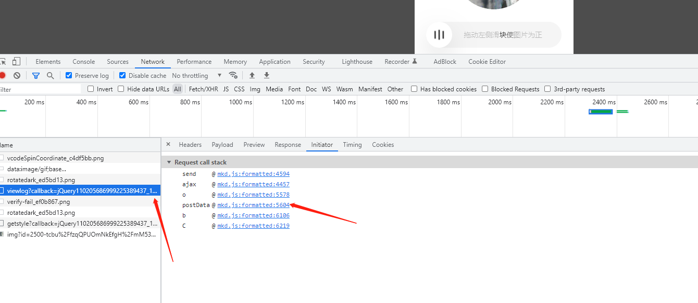

  在r.rzData中ac_c是检测的关键，ac_c=round((o / 212),2)，而o是滑动的距离，o=angle*212/360（这里大概是图片尺寸的关系所以乘以212/360） angle是识别的角度。然后backstr是前面返回的，其他的所有参数都可固定，包括轨迹fs是对r.rzData进行aes加密的结果（key是as+'appsapi0'） ps.为什么ac_c=round((o / 212),2)？我也不知道，网上找教程是这样说的，不过也确实成功
  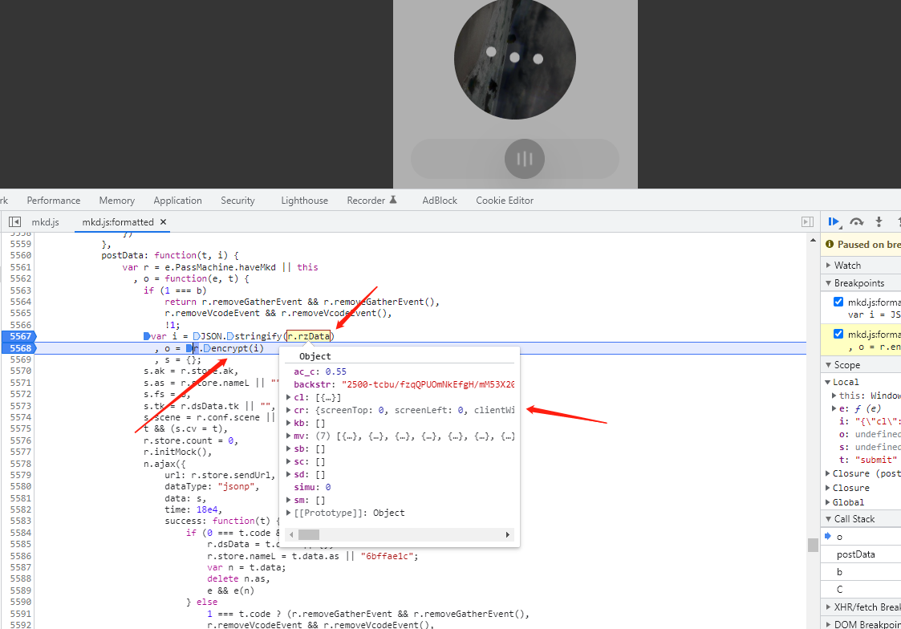

  对移动轨迹进行加密，其实就是AES加密
  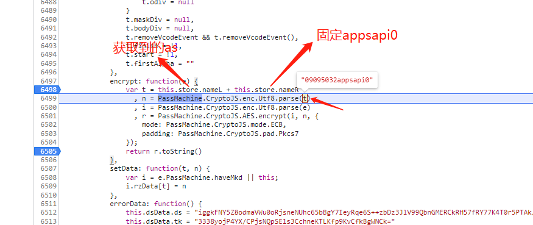

  js主要弄的东西
  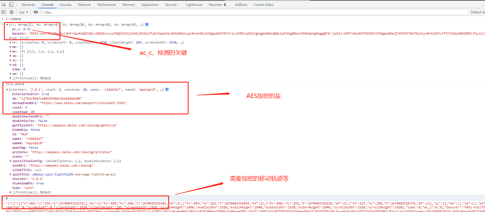

  
  重写js文件
  ```js
  var CryptoJS = require('crypto-js');
  
  function encrypt_(angle, as, backstr) {
      var tt = {
          "cl": [
              {
                  "x": 856,
                  "y": 299,
                  "t": 1669881034638
              }
          ],
          "mv": [
              {
                  "fx": 928,
                  "fy": 384,
                  "t": 1669881033914,
                  "bf": 2
              },
              {
                  "fx": 856,
                  "fy": 315,
                  "t": 1669881034069,
                  "bf": 2
              },
              {
                  "fx": 856,
                  "fy": 299,
                  "t": 1669881034242,
                  "bf": 2
              },
              {
                  "fx": 856,
                  "fy": 299,
                  "t": 1669881034646,
                  "bf": 1
              },
              {
                  "fx": 862,
                  "fy": 299,
                  "t": 1669881034803,
                  "bf": 1
              },
              {
                  "fx": 889,
                  "fy": 300,
                  "t": 1669881034974,
                  "bf": 1
              },
              {
                  "fx": 917,
                  "fy": 302,
                  "t": 1669881035133,
                  "bf": 1
              },
              {
                  "fx": 932,
                  "fy": 305,
                  "t": 1669881035289,
                  "bf": 1
              },
              {
                  "fx": 940,
                  "fy": 306,
                  "t": 1669881035445,
                  "bf": 1
              },
              {
                  "fx": 947,
                  "fy": 307,
                  "t": 1669881035610,
                  "bf": 1
              },
              {
                  "fx": 953,
                  "fy": 308,
                  "t": 1669881035764,
                  "bf": 1
              },
              {
                  "fx": 959,
                  "fy": 308,
                  "t": 1669881035950,
                  "bf": 1
              },
              {
                  "fx": 962,
                  "fy": 308,
                  "t": 1669881036105,
                  "bf": 1
              }
          ],
          "sc": [],
          "kb": [],
          "sb": [],
          "sd": [],
          "sm": [],
          "cr": {
              "screenTop": 0,
              "screenLeft": 0,
              "clientWidth": 1920,
              "clientHeight": 385,
              "screenWidth": 1920,
              "screenHeight": 1080,
              "availWidth": 1920,
              "availHeight": 1040,
              "outerWidth": 1920,
              "outerHeight": 1040,
              "scrollWidth": 1920,
              "scrollHeight": 1920
          },
          "simu": 0,
          "ac_c": (angle * 212 / 360 / 212).toFixed(2),
          "backstr": backstr
      };
      var t = as + 'appsapi0'
          , n = CryptoJS.enc.Utf8.parse(t)
          , i = CryptoJS.enc.Utf8.parse(JSON.stringify(tt))
          , r = CryptoJS.AES.encrypt(i, n, {
              mode: CryptoJS.mode.ECB,
              padding: CryptoJS.pad.Pkcs7
          });
      return [r.toString(), tt['ac_c']];
  }
  
  console.log(encrypt_('180','b157dbfd','8139-ugspjXUdZCZU/u9hcbcgo1RJnWC4X+4t2aCdlpy60GGVIrLESab/MLtmeimF5w/g2AmNZHcA6hRagjtrYXys0EGw6z1uXb8EzYaxaqy57Th17fQd606lEoO9W6I+GBOAGfsBS1cs2oTy3V3UosJMbVXxK7PW0Vj66sjZ64bz7YCGJHGz6sSg15YxMWw/7jN5N5Jk9/wUWg3CQ7pumoq47K7OCmLaNegbVAemuuEqMayn5gSL/ylXxX2VBPFPWJeoGqSCaT2mQEy6biiGIN2orsBMqFcIlBGqC5XK3A6c+5W4f31kBmfostrNjd1K3JsU/f6AXLS7cCcnSZYgcAyai2TWjmKSCtvUpe79scSThzG/MdojXwtA0stiY2oQ2F7+JLwf56zHV6q/TXUYe0gurw=='))
  ```

  然后各种请求获取参数，带上各种参数基本就可以了，不过有几点需要注意：**验证时需要通过两次，验证返回的参数中op=1理论上是成功了，但可能因为代理或者其他原因也不一定真的100%成功，反正继续尝试就是了，另外请求验证链接[https://wappass.baidu.com/viewlog/c](https://wappass.baidu.com/viewlog/c)所携带的callback跟上面的callback不一样，应该也是通过上面说道的js文件生成的不过固定也可以就懒得弄了**下面是成功的示例图：
  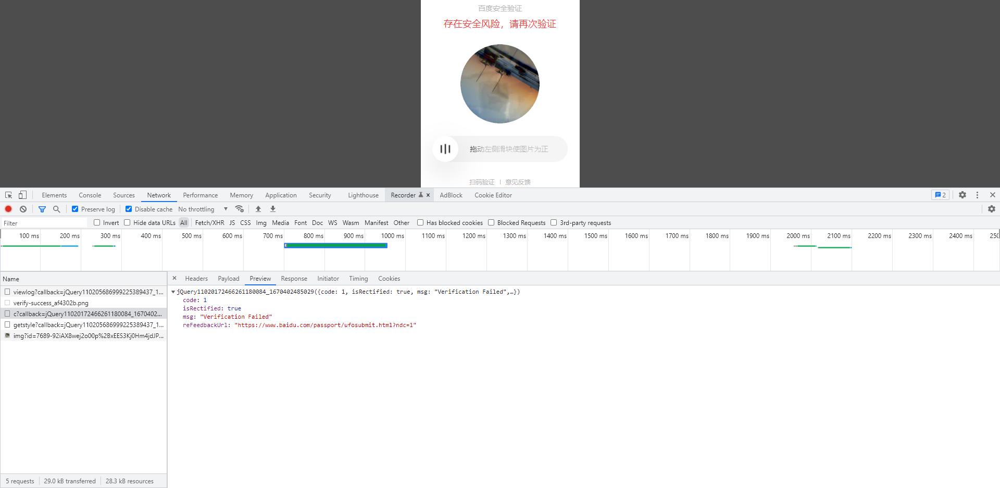
  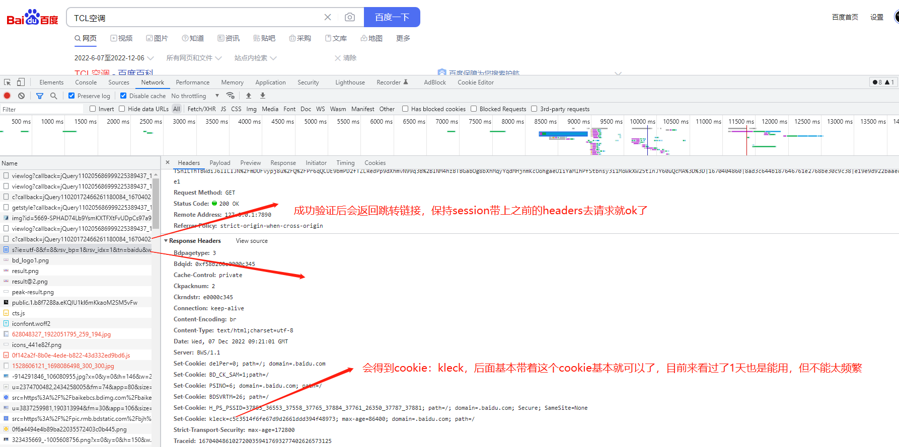
  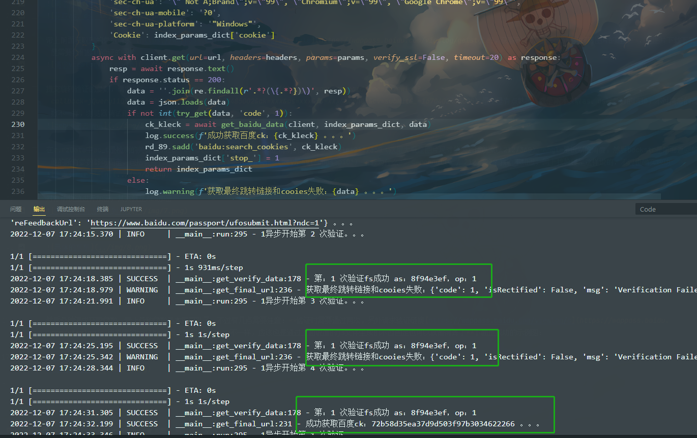
